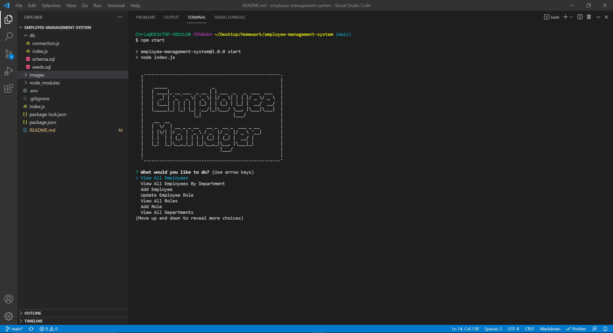

# Employee Management System #

  ## Table of Contents
* [Description](#description)
* [Installation](#installation)
* [Usage](#usage)
* [License](#license)
* [Contributors](#contributors)
* [Questions](#questions)

## Description
The employee management system allows for workplaces to keep track of their workers and to use different parameters to search.
## Install
Make sure to clone the repo, then in the root directory run npm install (inquirer,express,dotenv,asciiart-logo, mysql2, and console.table).
## Usage
For managers or upper management to maintain an up to date information base on different types of employees.
## License

## Contributors
Christopher Tangarife
## Questions
If you have any questions about the application contact me directly at Christangarife95@gmailcom 
# Contact
Christangarife95@gmail.com 
# Username
Check out my other work on [Github](https://github.com/ChrisCodes54)
# Screenshots and Video Link to walkthrough
Watch the walkthrough video by clicking [here](https://drive.google.com/file/d/1Cagbk0LSrsNls8g6QYmupzmG7A3gl5MQ/view?usp=sharing)

